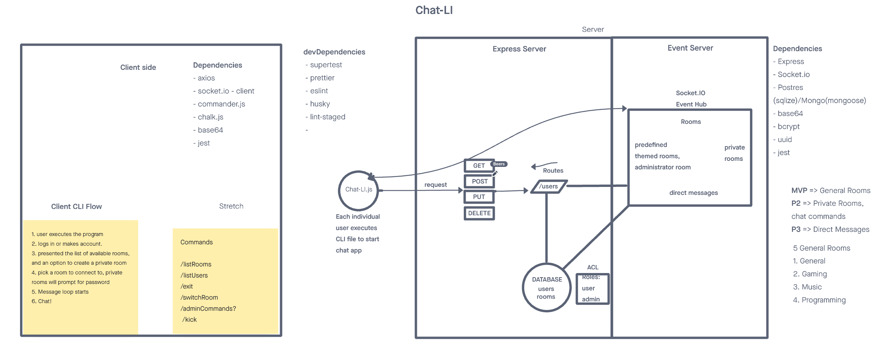
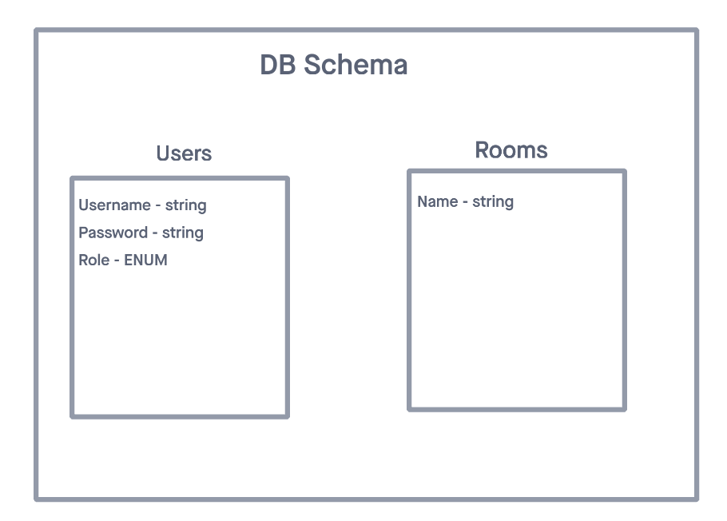

# Chat-Li

**Chat-Li** is a CLI that allows users to communicate via the terminal. Users will be able to create accounts as well as rooms by using the **Chat-Li** API. After this they can use the CLI to chat with other users connected to the same room. Be a command line hero with **Chat-Li** and enjoy communicating with friends in a new exciting, and colorful, way!

## **Team**:

- Marquesa Asmussen
- Alexander Beers
- Christopher Burk
- Kason Braley

---

### [User Stories](https://github.com/orgs/Chat-LI/projects/3)

### [Software Requirements](./docs/requirements.md)

---

### Wireframes

### Database Schema

